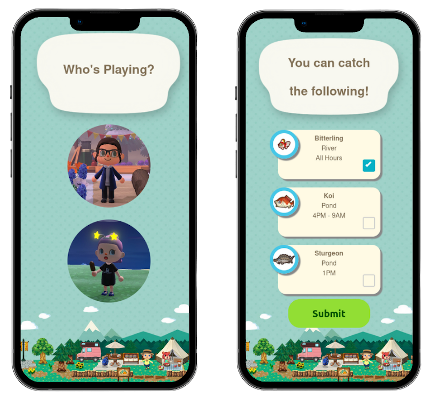

# Collection To Do - Animal Crossing

## What is Collection To Do?
An application built with Django and Vue to display remaining collectables in Animal Crossing: New Horizons. Selecting a character shows what is currently 'catchable' depending on on their personal collection and the current month of the year. I have this running in docker, and have also included my Docker files for both the front and backend.

## Usage
Clone the front and back end. Run the Docker files on your desired ports. Ensure you're using the right lines in settings.py for the database.
